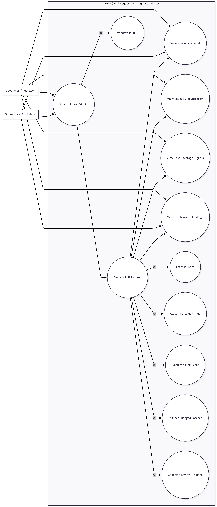
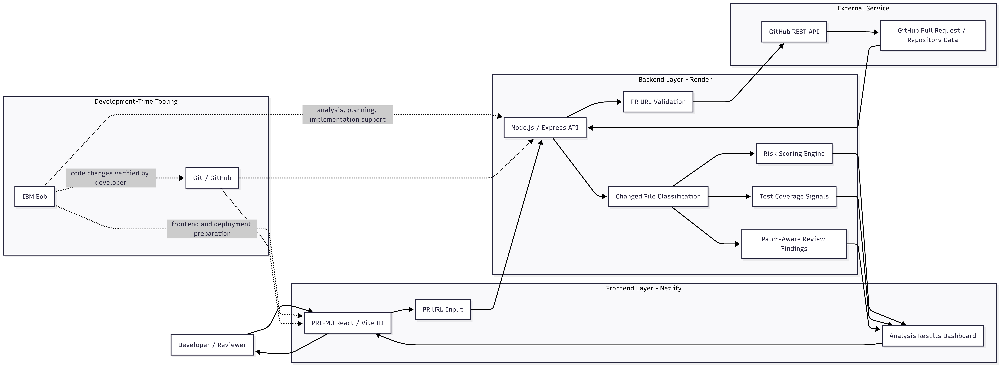
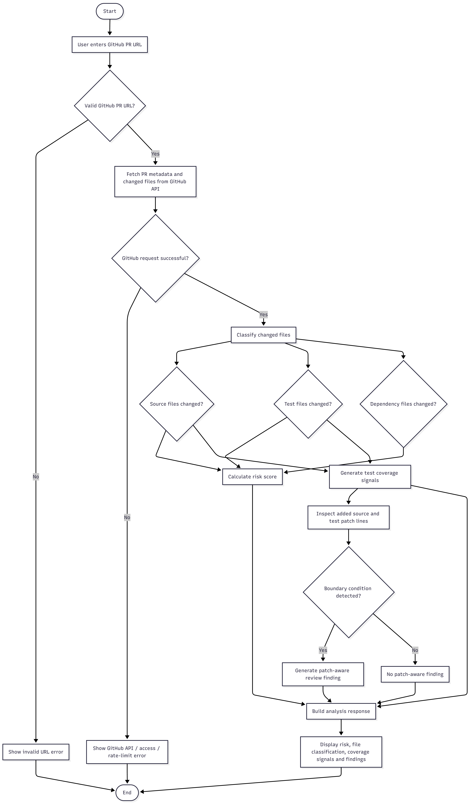

# PRI-MO — Pull Request Intelligence Monitor

> **Catch what your tests might miss.**

PRI-MO is a deployed web application that analyses a GitHub pull request before it is merged. Paste any public PR URL and PRI-MO classifies the changed files, scores the risk, reports test coverage signals, and flags boundary-gap conditions using patch-aware heuristics — all from a single call to the GitHub REST API.

---

## The Problem

Pull requests that modify production logic without updating tests are a common source of post-merge regressions. Standard CI pipelines tell you whether tests *pass*, but not:

- whether the *changed code* is covered by any test at all, or
- whether the test suite exercises boundary conditions introduced by the PR.

Code reviewers must catch these gaps manually, which is inconsistent and time-consuming.

---

## The Solution

PRI-MO performs automated pre-merge analysis using only the metadata and patch strings that GitHub already exposes. It requires no code checkout, no test runner, and no static-analysis toolchain. A reviewer can run an analysis in seconds, before opening a single file.

---

## Live Demo

| Service | URL |
|---|---|
| **Frontend** | [https://6a9380a9b551c9993893a8ea--loquacious-toffee-c39475.netlify.app](https://6a9380a9b551c9993893a8ea--loquacious-toffee-c39475.netlify.app) |
| **Backend API** | [https://primo-api.onrender.com](https://primo-api.onrender.com) |

Paste any public GitHub pull request URL and click **Analyze my PR**.

---

## Key Features

| Feature | Description |
|---|---|
| **File classification** | Identifies source files (`.js`, non-test), test files, and dependency files from the PR diff |
| **Risk scoring** | Scores 0–6+ based on source changes, missing tests, and dependency changes; returns LOW / MEDIUM / HIGH |
| **Test coverage signals** | Reports whether source and test files both changed; lists changed test filenames |
| **Patch-aware boundary-gap detection** | Scans added lines in source patches for numeric boundary conditions on `quantity`, `price`, `count`, `amount`, and `total`; cross-references values actually exercised in test patches |
| **Structured error handling** | Returns a human-readable `error` string and a machine-readable `code` field for 7 distinct failure modes |
| **Optional GitHub authentication** | Accepts a `GITHUB_TOKEN` environment variable to raise the GitHub API rate limit from 60 to 5,000 requests per hour |

---

## Architecture

### Use Case Diagram


### System Architecture Diagram


### Analysis Flow / Activity Diagram


### Sequence Diagram


### Service overview

```
Browser  (React + Vite — Netlify)
       │
       │  POST /analyze-pr  { url: "https://github.com/owner/repo/pull/N" }
       ▼
Backend  (Express — Render)
       │
       ├─ GET https://api.github.com/repos/:owner/:repo/pulls/:number
       └─ GET https://api.github.com/repos/:owner/:repo/pulls/:number/files
                        │
                        ▼
               GitHub REST API
```

- **Frontend** — Netlify-hosted static site built with React 19 and Vite 8. Reads `VITE_API_URL` at build time; falls back to `http://localhost:4000` for local development.
- **Backend** — Render-hosted Node.js service using Express 5 and Axios. Binds to `0.0.0.0` on `process.env.PORT` (default 4000). Optionally authenticates GitHub requests using `GITHUB_TOKEN`.
- **No database.** All analysis is computed per-request from the GitHub API response.

---

## How PRI-MO Works

1. The frontend sends one `POST /analyze-pr` request to the PRI-MO backend with the PR URL.
2. The backend parses the URL to extract `owner`, `repo`, and `pullNumber`.
3. The backend makes two GitHub REST API requests: one for PR metadata and one for the changed-file list including patch strings.
4. Changed files are classified into source files, test files, and dependency files.
5. A risk score is computed from three rules:
   - +2 — production source code was modified
   - +3 — source changed but no test files changed
   - +1 — dependency files changed
   - Score ≥ 5 → HIGH, ≥ 3 → MEDIUM, otherwise LOW
6. `testCoverageSignals` is built from the boolean relationship between source and test file changes.
7. Added lines (`+` prefix) in source patches are scanned for boundary conditions (`>=`, `>`, `<=`, `<`) on domain variables (`quantity`, `price`, `count`, `amount`, `total`). Tested values are extracted from `quantity: N` patterns in test patches. A `boundary-gap` finding is emitted when no tested value exercises beyond the detected threshold.
8. The backend returns all results in a single JSON response. The frontend renders classification, risk, coverage signals, and findings.

---

## Three Tested PR Scenarios

### PR #1 — Add quantity-based order discount

A PR that adds a `quantity >= 3` discount condition to the Shop API and includes a test for `quantity: 3`.

| Metric | Value |
|---|---|
| Source files changed | 1 |
| Test files changed | 1 |
| Dependency files changed | 2 |
| Commits | 3 |
| Risk level | **MEDIUM** |
| Risk score | 3 |

**testCoverageSignals:** source changed ✓, tests changed ✓

**reviewFindings:** boundary-gap detected for `quantity >= 3`. The test demonstrates the exact threshold value but no value greater than 3 — PRI-MO flags that the range above the threshold is unexercised by the changed tests.

---

### PR #2 — Strengthen order quantity validation

A PR that tightens a `quantity <= 0` guard in source code with no accompanying test changes.

| Metric | Value |
|---|---|
| Source files changed | 1 |
| Test files changed | 0 |
| Dependency files changed | 0 |
| Commits | 1 |
| Risk level | **HIGH** |
| Risk score | 5 |

**testCoverageSignals:** source changed ✓, tests changed ✗

**reviewFindings:** boundary-gap detected for `quantity <= 0`. Because no test files changed, `testedValues` is empty — PRI-MO's recommendation explains that *no changed tests exercise this boundary at all*, rather than claiming only the threshold value is demonstrated.

---

### PR #3 — Add Shop API package description

A PR that updates only `package.json` metadata with no source or test changes.

| Metric | Value |
|---|---|
| Source files changed | 0 |
| Test files changed | 0 |
| Dependency files changed | 1 |
| Commits | 1 |
| Risk level | **LOW** |
| Risk score | 1 |

**testCoverageSignals:** source changed ✗, tests changed ✗

**reviewFindings:** none — no source patches to scan, no boundary conditions detected.

---

## IBM Bob Development Workflow

IBM Bob (IBM's AI coding assistant) was used throughout the development of PRI-MO as a technical planning and implementation partner. **Bob is not part of the deployed application and is not called at runtime.** It runs only during development.

Bob was used to:

- Analyse the Shop API's discount logic and identify untested edge cases and missing test coverage
- Plan and implement `testCoverageSignals`, `reviewFindings`, and structured error handling — proposing JSON shapes and heuristic rules before any code was written
- Implement each approved change surgically, preserving existing behaviour at every step
- Identify and fix a recommendation wording bug where an empty `testedValues` array produced a misleading message
- Propose and implement deployment-readiness changes (`process.env.PORT`, `0.0.0.0` binding, `VITE_API_URL`)
- Design and implement optional GitHub token authentication with zero token exposure in responses or logs
- Review limitations and surface caveats at each planning stage

---

## Tech Stack

| Layer | Technology | Version |
|---|---|---|
| Frontend framework | React | 19 |
| Frontend build tool | Vite | 8 |
| Frontend hosting | Netlify | — |
| Backend framework | Express | 5 |
| HTTP client (backend) | Axios | 1 |
| Backend hosting | Render | — |
| External data source | GitHub REST API v3 | — |
| Development assistant | IBM Bob | — |

---

## Local Setup

### Prerequisites

- Node.js 18 or later
- npm

### Backend

```bash
cd pr-guardian/backend
npm install
node index.js
# Backend listens on http://localhost:4000
```

To use an authenticated GitHub token, set the environment variable in your shell before starting the process:

```bash
export GITHUB_TOKEN=ghp_your_token_here
node index.js
```

> The backend does not use `dotenv`. `GITHUB_TOKEN` must be set as a process environment variable, not in a `.env` file, unless you add `dotenv` separately.

### Frontend

```bash
cd pr-guardian/frontend
npm install
npm run dev
# Frontend served by Vite on http://localhost:5173
```

By default the frontend points to `http://localhost:4000`. To override:

```bash
export VITE_API_URL=http://localhost:4000
npm run dev
```

> `VITE_API_URL` is baked into the bundle at build time. Changing it after `npm run build` has no effect without a rebuild.

---

## Deployment Configuration

### Backend (Render)

| Variable | Required | Description |
|---|---|---|
| `PORT` | No | Injected automatically by Render |
| `GITHUB_TOKEN` | No | GitHub PAT (public read, zero scopes required). Raises the rate limit from 60 to 5,000 requests per hour |

### Frontend (Netlify)

| Variable | Required | Description |
|---|---|---|
| `VITE_API_URL` | **Yes** | Full URL of the deployed backend with no trailing slash. Must be set as a **build-time** environment variable in the Netlify dashboard |

---

## Limitations

- **File classification is filename-based.** A source file named `utils.test-helpers.js` would be misclassified as a test file because its name contains `test`.
- **Patch-only detection scope.** Boundary-gap detection only scans lines added in the current PR diff. A condition that existed before the PR and was not touched by this PR will not be detected.
- **Tested-value extraction covers `quantity` only.** The boundary-gap scanner detects conditions on all five domain variables (`quantity`, `price`, `count`, `amount`, `total`), but tested-value extraction only reads `quantity: N` patterns from test patches. Other variables may trigger false-gap findings.
- **GitHub omits patches for large diffs and binary files.** These files are skipped silently.
- **`VITE_API_URL` requires a rebuild to change.** It is resolved at Vite build time, not at runtime.
- **No dotenv support in backend.** `GITHUB_TOKEN` must be a real process environment variable; it is not read from a `.env` file.

---

## Future Improvements

- Extract tested values for all domain variables (`price`, `count`, `amount`, `total`), not just `quantity`.
- Detect off-by-one gaps — flag when only the threshold value itself (`N`) is tested for a `>= N` condition, as well as when nothing is tested at all.
- Surface untested error paths — identify `400` and `404` handler branches in source patches that have no negative-case assertions in the test patches.
- Add `GITHUB_TOKEN` to `.env.example` with documentation.
- Add a GitHub Actions workflow to run the Shop API test suite on every PR targeting the main branch.

---

*Student-built developer tooling · Powered by GitHub data · Built with IBM Bob*
